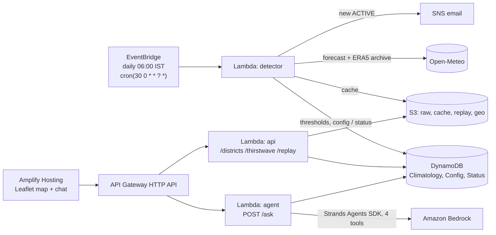

# ThirstCast 💧

> Everyone forecasts how hot the air will be. Nobody forecasts how thirsty it will be.
> ThirstCast detects thirstwaves and tells you, in litres, what the sky is about to drink.

**Team LLF** · Environmental Hacks (AWS × Bharat) · Track 02: Heat and Water

| | |
|---|---|
| Live dashboard | `<Amplify URL>` (TODO after AN-10) |
| Public API | `<ApiUrl>` (TODO after deploy) |
| Demo video (3 min) | `<link>` (TODO) |
| Methods | [frontend/methods.html](frontend/methods.html) · [docs/methods.md](docs/methods.md) · [docs/numbers.md](docs/numbers.md) |

## The problem
India warns about heat (temperature) and drought (rainfall deficit), but does not track how fast the atmosphere
pulls water out of crops, lakes and reservoirs: the atmospheric evaporative demand (ET0), which depends on
temperature, humidity, wind and sunshine together. A **thirstwave** is a run of 3 or more days when ET0 is above its
local 90th percentile (Kukal & Hobbins 2025, *Earth's Future*). As The Hindu put it in June 2025, "according to
experts, there is essentially no data about extreme thirstwaves over India."

> ET₀ is standard. Event-based thirstwave detection, locally thresholded and translated into litres per stakeholder,
> exists today as a research prototype in the US. To our knowledge, we are first to build it for India.

## What it does
1. **Detects** active thirstwaves in Bengaluru Urban, Kolar and Mandya against a 30-year local climatology
   (ERA5, 1994-2023, ±7-day window, p90).
2. **Forecasts** the next 7 days, correcting the offset between the forecast model and the ERA5 archive.
3. **Translates** excess ET0 into litres: extra irrigation per acre by crop (paddy, sugarcane, tomato, ragi; Kc ±10%)
   and extra evaporation from Bellandur, Varthur and the KRS reservoir. All litres are estimates.
4. **Delivers** it through a live map, a public API, an AI agent that answers in English and Hindi, and email alerts.

## Evidence: Bengaluru Urban, April 2024 (replayed, historical data)
* ET0 above its day-of-year p90 on **22 of 30 days**: the **worst April since 1994** (1st of 31 Aprils).
* Cumulative excess **+13.3 mm**, defined as the *sum of daily ET0 above the local day-of-year p90 threshold*:
  about **53,700 litres per acre** of extra reference-crop demand (estimate).
* Temperature was also above its own p90 on 24 of 30 days, so we do not claim heat alerts missed it.
* Bengaluru's 2024 crisis was fundamentally a supply failure (poor 2023 monsoon, failing borewells, Cauvery
  shortfalls). We do not claim thirstwaves caused it; we show the demand side nobody was measuring.

Every number comes from [`docs/numbers.md`](docs/numbers.md), generated by `data/scripts/replay_april_2024.py`.

## Try it
```bash
curl "$API/districts"
curl "$API/thirstwave/Mandya"
curl "$API/replay/Bengaluru_Urban"
curl -X POST "$API/ask" -H 'content-type: application/json' -d '{"question":"Will Mandya face a thirstwave this week?"}'
curl -X POST "$API/ask" -H 'content-type: application/json' -d '{"question":"क्या इस हफ्ते मंड्या में थर्स्टवेव आएगी?"}'
```
More prompts: "How much extra water do 2 acres of paddy in Mandya need this week?", "Is Kolar just hot this week, or
also thirsty?", "बेंगलुरु की झीलों से इस हफ्ते कितना अतिरिक्त पानी उड़ेगा?". Contract: [docs/api-contract.md](docs/api-contract.md).

## Architecture

Open-source tools: **Strands Agents SDK** (agent), **AWS SAM CLI** (deploys `backend/template.yaml`). Logs: CloudWatch (7 days).
Deliberately not used: SageMaker (no time to train responsibly), OpenSearch (3 districts do not need it), Cognito
(public advisory tool, no login).

## Repo
| Path | What |
|---|---|
| `data/` | Open-Meteo pulls, climatology, April 2024 replay, bias, blindspot finder ([data/README.md](data/README.md)) |
| `backend/core/python/thirstcast_core/` | pure-Python detection, litres, bias, pipeline (shared by everything) |
| `backend/functions/` | `api`, `detector`, `agent` Lambdas + `common/dynamo_repo.py` |
| `backend/template.yaml` | SAM stack |
| `agent/` | Strands agent, tools, Hindi/English template fallback, eval ([agent/README.md](agent/README.md)) |
| `frontend/` | static Leaflet dashboard ([frontend/README.md](frontend/README.md)) |

Tests: `python -m pytest backend/core agent/tests backend/tests -q` (no AWS needed; backend tests use moto).
Deploy: [docs/DEPLOY.md](docs/DEPLOY.md) (`cd backend && sam build && sam deploy --guided`).

## Limits
District-centroid estimate (~10 km grid), not field-level · all litre figures are estimates with ranges; lake figures
are upper bounds (maximum lake / full-reservoir areas) · ET0 is reference demand, not measured crop use · forecast
bias corrected by a mean offset only · city household demand is not modelled · advisory only.

## Data and licences
Open-Meteo (CC BY 4.0, free tier non-commercial; we cache everything) with ERA5 / ERA5-Land (Copernicus C3S) ·
FAO-56 (Allen et al. 1998) · DataMeet India district boundaries (CC BY 2.5 IN) · OpenStreetMap (ODbL) ·
lake areas: IISc ETR-116 (2017), IRJET 6(9) 2019. Details: [docs/sources.md](docs/sources.md).

## Team LLF
Aneek Das (lead, backend/AWS) · Kunal Dadlani (data) · Rishit Sharma (frontend) · Priyanshu Dwivedi (agent/demo)

Licence: MIT.
